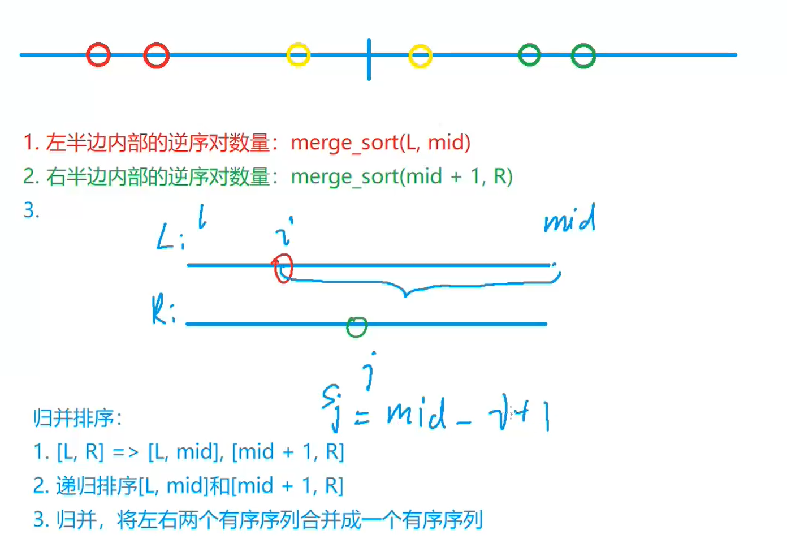

## 788 逆序对的数量
[原题链接](https://www.acwing.com/problem/content/790/)

给定一个长度为 n
 的整数数列，请你计算数列中的逆序对的数量。

逆序对的定义如下：对于数列的第 i
 个和第 j
 个元素，如果满足 i<j
 且 a[i]>a[j]
，则其为一个逆序对；否则不是。

**输入格式**
  
第一行包含整数 n
，表示数列的长度。

第二行包含 n
 个整数，表示整个数列。

**输出格式**
  
输出一个整数，表示逆序对的个数。

**数据范围**
  
1≤n≤100000
，
数列中的元素的取值范围 [1,109]
。

**输入样例：**
```
6
2 3 4 5 6 1
```
**输出样例：**
```
5
```
**解析**
 归并排序过程中，已经排序的一定会小于，当qi>qj则qi之后所有都大于qj，这些（mid-i+1）都和qj构成逆序对
 
**答案**
 ```
 #include<iostream>
using namespace std;
typedef long long LL;
const int N=100010;
int n;
int q[N],tmp[N];
int count_reverse(int l,int r){
    if(l>=r)return 0;
    int mid=l+r>>1;
    LL res=count_reverse(l,mid)+count_reverse(mid+1,r);
    int k=0,i=l,j=mid+1;
    while(i<=mid&&j<=r){
        if(q[i]<=q[j]){
            tmp[k++]=q[i++];
        }
        else {
            tmp[k++]=q[j++]; 
            res+=mid-i+1;
        }
    }
    while(i<=mid)tmp[k++]=q[i++];
    while(j<=r)tmp[k++]=q[j++];
    for(i=l,j=0;i<=r;i++,j++){
        q[i]=tmp[j];
    }
    return res;
}
int main(){
    cin>>n;
    for(int i=0;i<n;i++)cin>>q[i];
    cout<<count_reverse(0,n-1)<<endl;
    return 0;
}
 ```
