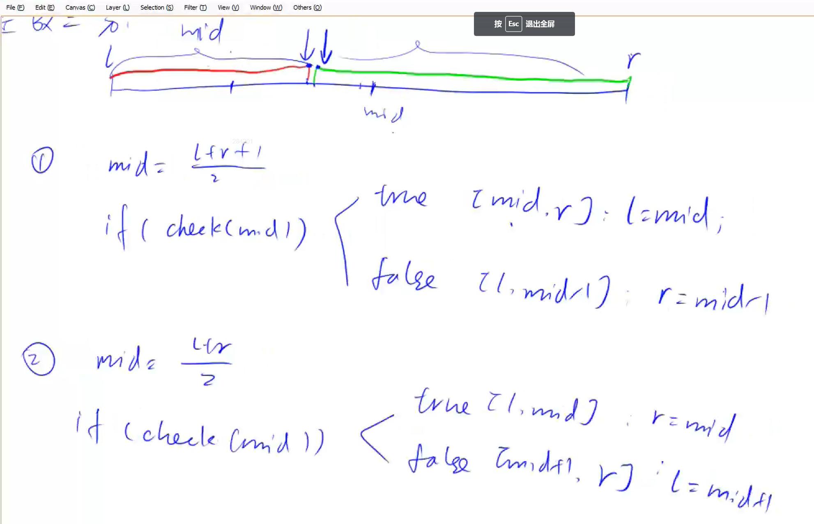

### 789 数的范围
[原题链接](https://www.acwing.com/problem/content/791/)

给定一个按照升序排列的长度为 n
 的整数数组，以及 q
 个查询。

对于每个查询，返回一个元素 k
 的起始位置和终止位置（位置从 0
 开始计数）。

如果数组中不存在该元素，则返回 -1 -1。

**输入格式**
第一行包含整数 n
 和 q
，表示数组长度和询问个数。

第二行包含 n
 个整数（均在 1∼10000
 范围内），表示完整数组。

接下来 q
 行，每行包含一个整数 k
，表示一个询问元素。

**输出格式**
共 q
 行，每行包含两个整数，表示所求元素的起始位置和终止位置。

如果数组中不存在该元素，则返回 -1 -1。

**数据范围**
1≤n≤100000

1≤q≤10000

1≤k≤10000
**输入样例：**
```
6 3
1 2 2 3 3 4
3
4
5
```
**输出样例：**
```
3 4
5 5
-1 -1
```
**解析**
1.  模板一
我们最终要找的边界是一个性质在右半区符合，在左半区不符合的性质。我们要找符合的右半区的左边界点。管中窥豹的判断check（mid）,如果mid符合条件Mid是在右半区符合性质的半区中。要找左边界点的范围则更新为r = mid（包含Mid）。如果mid不符合条件，我们要找符合性质的左端点则l = mid + 1（已经确定mid是不符合的就从mid+1开始算）

2.  模板二
我们最终找的边界是一个性质在右半区不符合，在左半区符合的性质。并找到符合性质的左半区的右边界点。对mid进行判断来获得结果：如果mid符合条件，则mid就在左半区，那么我们要找的右边界点就可以更新为（mid,r）l = mid。
如果mid不满足条件，则mid必然在右半区间，而我们要找的符合要求的左半区间性质的右端点就是（l,mid-1）。r = mid - 1;
模板二要防止死循环：当mid = l + r >> 1时，加入l = r - 1当判断mid满足性质在左半区会更新为l = mid;而mid = (r - 1 + r)/2 = r - 0.5 = r - 1 = l(向下取整)，则更新完仍然是l = r- 1没变化会死循环




**答案**
```
#include<iostream>
using namespace std;
const int N=100010;
int n,q,k;
int a[N];
void binary_search(int l,int r,int x){
    while(l<r){
        int mid=l+r>>1;
        if(a[mid]>=x)r=mid;
        else l=mid+1;
    }
    if(a[l]!=x)cout<<"-1 -1"<<endl;
    else{
        cout<<l<<' ';
        l=0,r=n-1;
        while(l<r){
           int mid=l+r+1>>1;
           if(a[mid]<=x)l=mid;
           else r=mid-1;
        }
        cout<<r<<endl;
    }
}
int main(){
    cin>>n>>q;
    for(int i=0;i<n;i++)cin>>a[i];
    while(q--){
        int x;
        cin>>x;
        binary_search(0,n-1,x);
    }
    return 0;
}
```
